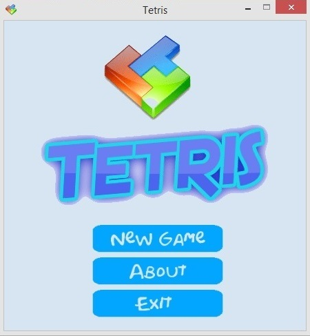
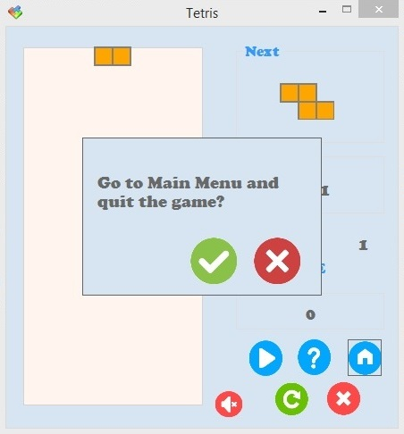

TetrisGame
===================

Implementation of the game Tetris with C# in Windows Forms

##1. Опис на апликацијата

**Тетрис** е една од најпознатите логички видео-игри. Играта е направена во 1984 година од рускиот научник Алексей Пажитнов. Името на играта "tetris" доаѓа од грчкиот префикс **"tetra-" ("четири")**, затоа што сите делови се составени од четири сегменти, и **tenis**, омилената игра на Пажитнов. Најголем дел од својата популарност Тетрис ја има добиено на [Nintendo Game boy](https://en.wikipedia.org/wiki/Game_Boy).

Деловите (наречени тетримино) составени од четири квадратчиња паѓаат од врвот на полето за игра, кое е широко десет, а високо дваесет квадратчиња. Играчот може тетриминото што паѓа да го ротира, поместува лево и десно и да го забрзува неговото паѓање, односно да ги составува тетримината на начин што помеѓу квадратчињата да не останува празен простор. 
Кога еден ред се пополнува со сите делови, тој исчезнува, а квадратчињата кои биле над него паѓаат во новосоздадениот простор. 
Како што играта напредува, деловите паѓаат се побрзо и играчот има се помалку време за размислување и составување. Кога деловите ќе се натрупуваат до врвот на полето за игра, без можност да се појави нов дел, играта е завршена.

На случаен начин се одбира кој тетримино следен ќе се појави на врвот на полето. Тетримината според редоследот на кој се наредени квадратчињата во нив, наликуваат на буквите **I, J, L, O, S, T и Z**. Сите делови можат да отстранат два реда, I, J i L можат да отстранат три реда, а само тетриминото I може да отстрани четири реда одеднаш - што се вика **"тетрис"**. 

Начинот на добивање поени е заснован на принцип така што поените се доделуваат се секој успешно елиминиран ред. Бонус поени се доделуваат за елиминирање на повеќе редови истовремено (два, три или "тетрис" - четири).

##2. Претставување на функционалностите

На почетокот кога се стартува апликацијата се прикажува почетниот изглед. Тука има 3 можности за избор. Со кликнување на копчето **New Game** започува играта. Копчето **About** го отвара погледот кој содржи опис на играта. Со копчето **Exit** се исклучува апликацијата.

###2.1. Playing Game
По кликнување на копчето **New Game** се отвара нов поглед кој овозможува играње на играта. Тука се одвива целата игра. Во левиот дел се наоѓа полето за игра. Во десниот дел се прикажуваат следното тетримино, времето кое изминало од почетокот на играта, нивото како и бројот на освоени поени. Во овој поглед има и копчиња кои овозможуваат контрола на играта:

-  **Quit/Exit** -> исклучување на играта.

-  **New Game** -> започнување нова игра.

-   **Sound Off/On** -> вклучување/исклучување на звуците.

-  **Main menu** -> префрлување на почетниот поглед.

-  **Help** -> прикажување помош околу правилата и начинот на игра.

-   **Pause/Play** -> паузирање/продожување со играта.

###2.2. About Game
Овој поглед се отвара откако ќе се кликне копчето **About** од почетниот поглед или копчето **Help** од погледот за игра. Тука се опишани начинот и правилата на игра.

###2.3. End Game
Играта може да заврши на 4 начини:

- Доколку се кликне копчето **Exit** при што се отвара прозорец за избирање дали навистина корисникот сака играта да биде завршена. Во случај на потврден одговор играта завршува и апликацијата се исклучува. Во спротивно се исклучува прозорецот и продолжува играта.

 

- Доколку со поставување на тетримината се стигне до врвот на полето за игра. Во тој момент се појавува прозорец во кој се прикажани освоените поени, како и највисоките поени кои се постигнати до тој момент. Откако ќе биде затворен овој прозорец започнува нова игра.
 
 

-  Доколку се кликне на копчето **New Game** од погледот за игра. При тоа се прикажува прозорецот во кој се прикажани освоените поени и највисоките поени кои се постигнати до тој момент. Потоа започнува нова игра.

- Доколку се кликне на копчето **Main Menu** од погледот за игра при што се прикажува прозорец за избирање дали навистина корисникот сака да оди во главното мени, односно на почетниот поглед. Во случај на потврден одговор играта завршува и се прикажува почетниот поглед. Во спротивно играта продолжува.

 

###2.4. Начин на игра

Играта се игра со помош на копчињата за лево, десно, нагоре, надолу од тастатура. Со копчето за *лево* тетриминото се поместува за една позиција налево. Со копчето за *десно* тетриминото се поместува за една позиција надесно. Копчето за *надоле* го забрзува паѓањето на тетриминото. Копчето за *нагоре* го ротира копчето за 90o во насока на движењето на стрелките на часовникот. Целта е да се пополнат колку е можно повеќе квадратчиња од полето за игра и да се освојат колку е можно повеќе поени.