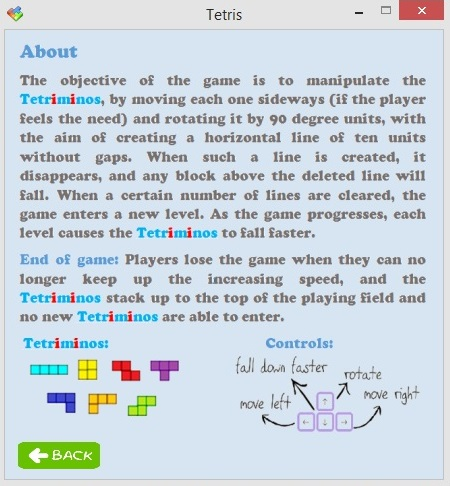

TetrisGame
===================

Implementation of the game Tetris in C#


##1. Опис на апликацијата

**Тетрис** е една од најпознатите логички видео-игри. Играта е направена во 1984 година од рускиот научник Алексей Пажитнов. Името на играта **"Tetris"** доаѓа од грчкиот префикс **"tetra-" ("четири")**, затоа што сите делови се составени од четири сегменти, и **"tenis"**, омилената игра на Пажитнов. Најголем дел од својата популарност Тетрис ја има добиено на [Nintendo Game boy](https://en.wikipedia.org/wiki/Game_Boy).

Деловите (наречени тетримино) составени од четири квадратчиња паѓаат од врвот на полето за игра, кое е широко десет, а високо дваесет квадратчиња. Играчот може тетриминото моментално што паѓа да го ротира, поместува лево и десно и да го забрзува неговото паѓање, односно да ги составува тетримината на начин што помеѓу квадратчињата да не останува празен простор. 
Кога еден ред се пополнува со сите делови, тој исчезнува, а квадратчињата кои биле над него паѓаат во новосоздадениот простор. 
Како што играта напредува, деловите паѓаат сè побрзо и играчот има сè помалку време за размислување и составување. Кога деловите се натрупуваат до врвот на полето за игра, без можност да се појави нов дел, играта е завршена.


На случаен начин се одбира кој тетримино следен ќе се појави на врвот на полето. Тетримината според редоследот на кој се наредени квадратчињата во нив, наликуваат на буквите **I, J, L, O, S, T и Z**. Сите делови можат да отстранат два реда, I, J i L можат да отстранат три реда, а само тетриминото I може да отстрани четири реда одеднаш - што се нарекува **"тетрис"**. 

Начинот на добивање поени е заснован на принцип така што поените се доделуваат со секој успешно елиминиран ред. Бонус поени се доделуваат за елиминирање на повеќе редови истовремено (два, три или "тетрис" - четири).

##2. Претставување на функционалностите

На почетокот кога се стартува апликацијата се прикажува почетниот изглед. Тука има 3 можности за избор. Со кликнување на копчето **New Game** започува играта. Копчето **About** го отвара погледот кој содржи опис на играта. Со копчето **Exit** се исклучува апликацијата.


###2.1. Playing Game
По кликнување на копчето **New Game** се отвара нов поглед кој овозможува играње на играта. Тука се одвива целата игра. Во левиот дел се наоѓа полето за игра. Во десниот дел се прикажуваат следното тетримино, времето кое изминало од почетокот на играта, нивото како и бројот на освоени поени. Во овој поглед има и копчиња кои овозможуваат контрола на играта:

-  **Quit/Exit** ⇒ исклучување на играта.

-  **New Game** ⇒ започнување нова игра.

-   **Sound Off/On** ⇒ вклучување/исклучување на звуците.

-  **Main menu** ⇒ префрлување на почетниот поглед.

-  **Help** ⇒ прикажување помош околу правилата и начинот на игра.

-   **Pause/Play** ⇒ паузирање/продолжување со играта.


###2.2. About Game
Овој поглед се отвара откако ќе се кликне копчето **About** од почетниот поглед или копчето **Help** од погледот за игра. Тука се опишани начинот и правилата на игра.



###2.3. End Game
Играта може да заврши на 4 начини:

- Доколку се кликне копчето **Exit** при што се отвара прозорец за избирање дали навистина корисникот сака играта да биде завршена. Во случај на потврден одговор играта завршува и апликацијата се исклучува. Во спротивно се исклучува прозорецот и продолжува играта.

 

- Доколку со поставување на тетримината се стигне до врвот на полето за игра. Во тој момент се појавува прозорец во кој се прикажани освоените поени, како и највисоките поени кои се постигнати до тој момент. Откако ќе биде затворен овој прозорец започнува нова игра.
 
 

-  Доколку се кликне на копчето **New Game** од погледот за игра. При тоа се прикажува прозорецот во кој се прикажани освоените поени и највисоките поени кои се постигнати до тој момент. Потоа започнува нова игра.

- Доколку се кликне на копчето **Main Menu** од погледот за игра при што се прикажува прозорец за избирање дали навистина корисникот сака да оди во главното мени, односно на почетниот поглед. Во случај на потврден одговор играта завршува и се прикажува почетниот поглед. Во спротивно играта продолжува.

 

###2.4. Начин на игра

Играта се игра со помош на копчињата за лево, десно, нагоре, надолу од тастатура. Со копчето за *лево* тетриминото се поместува за една позиција налево. Со копчето за *десно* тетриминото се поместува за една позиција надесно. Копчето за *надоле* го забрзува паѓањето на тетриминото. Копчето за *нагоре* го ротира копчето за 90<sup>o</sup> во насока на движењето на стрелките на часовникот. Целта е да се пополнат колку е можно повеќе квадратчиња од полето за игра и да се освојат колку е можно повеќе поени.


##3. Претставување на проблемот

###3.1 Класи

####3.1.1. Square

Square е класа која претставува едно квадратче. Секое квадратче е дефинирано од неговата позиција, т.е. координатите Х и У, големината на неговата страна, неговата боја и бојата на неговата рамка. Квадратчето има методи кои овозможуваат тоа да се поместува, лево, десно и надолу (овој метод се користи за да се овозможи забрзано движење на тетримината надолу кога корисникот ќе притисне на стрелката надолу) како и метод за цртање.

####3.1.2. Tetrimino

Класата Tetrimino е апстрактна. Таа ја претставува формата тетримино, т.е. блокот кој паѓа. Постојат 7 видови на тетримина и сите тие ја наследуваат класата Tetrimino. Секое тетримино, по дефиниција содржи 4 квадратчиња, треба да може да се поместува лево и десно, да може да паѓа забрзано и да може да се врти, при тоа поминувајќи од една во друга состојба, такви има 4.
За да се најлесно имплементира и манипулира Tetrimino, потребно е да постои класа за квадратче, во нашата имплементација тоа е класата Square.

Tetrimino е класа која претставува едно тетримино, еден блок кој паѓа надолу. Секое тетримино е дефинирано од позицијата на неговите квадратчиња и неговата боја. Секоја форма има различна боја. Во Tetrimino се чува низа од Square, која што ги претставува 4-те квадратчиња, бидејќи секое квадратче си ја чува својата позиција, не е потребно да ги чуваме позициите на четирите квадратчиња во Tetrimino. Заради олеснување на пишување на функциите за манипулација на квадратчињата, тука сепак ги чуваме координатите на првото квадратче. Исто така, чуваме и променлива state, која ни кажува во каква состојба е тетриминото, т.е. во која ротација се наоѓа. Tetrimino ги содржи следните методи:

- Draw(Graphics g, Point p) - го користи методот Draw од класата Square за да ги исцрта квадратчињата кои ги содржи тетриминото и преку тоа самото тетримино.

```C#
		public void Draw(Graphics g, Point p)
        {
           for(int i=0; i<4; i++)
            {
                s[i].Draw(g, p);
            }
        }
```

- isOut() - проверува дали ново креираното тетримино се појавило на таблата или сèуште се наоѓа во просторот над првиот ред, каде што не е видливо за користникот.

```C#	
	 	 public bool isOut()
        {
            foreach(Square square in s)
            {
                if (square.Y < 0)
                    return true;
            }
            return false;
        }
```

- moveDown(List<Square[]> boardSquares) - го користи методот moveDown() на Square за да ги помести сите квадратчиња за еден ред подолу, со тоа поместувајќи го целото тетримино надолу. Овој метод се користи за да се овозможи забрзано движење на тетримината надолу кога корисникот ќе притисне на стрелката надолу.
Аналогно на ова се имплементирани и методите moveLeft(List<Square[]> boardSquares) и moveRight(List<Square[]> boardSquares).

```C#
		 public void moveDown(List<Square[]> boardSquares)
        {
            if (safeDown(boardSquares) == true)
            {
                for (int i = 0; i < 4; i++)
                {
                    s[i].moveDown();
                }
            }
        }
        
        	public void moveLeft(List<Square[]> boardSquares)
        {
            if (safeLeft(boardSquares) == true)
            {
                for (int i = 0; i < 4; i++)
                {
                    s[i].moveLeft();
                }
            }
        }

        	public void moveRight(List<Square[]> boardSquares)
        {
            if (safeRight(boardSquares) == true)
            {
                for (int i = 0; i < 4; i++)
                {
                    s[i].moveRight();
                }
            }
        }
  ```      	

- safeLeft(List<Square[]> boardSquares) - проверува дали секое од квадратчињата од кои е составено тетриминото се наоѓаат на таблата и дополнително дали ако целото тетримино се помести на едно место за лево состојбата ќе биде безбедна, т.е. дали сèуште целото тетримино ќе биде на таблата. Аналогно на ова се дефинирани и safeDown(List<Square[]> boardSquares) и safeRight(List<Square[]> boardSquares).

```C#
		 public bool safeLeft(List<Square[]> boardSquares)
        {
            for (int i = 0; i < 4; i++)
            {
                if (s[i].X < 1 || s[i].X > 9)
                {
                    return false;
                }
                if (s[i].Y >= 0 && s[i].Y < boardSquares.Count() && boardSquares[s[i].Y][s[i].X - 1] != null)
                {
                    return false;
                }
            }
            return true;
        }

        	public bool safeRight(List<Square[]> boardSquares)
        {
            for (int i = 0; i < 4; i++)
            {
                if (s[i].X >= boardSquares[0].Length - 1)
                {
                    return false;
                }
                if (s[i].Y >= 0 && s[i].Y < boardSquares.Count() && boardSquares[s[i].Y][s[i].X + 1] != null)
                {
                    return false;
                }

            }
            return true;
        }

        	public bool safeDown(List<Square[]> boardSquares)
        {
            for (int i = 0; i < 4; i++)
            {
                if (s[i].Y >= boardSquares.Count - 1)
                {
                    return false;
                }
                if (s[i].Y >= 0 && s[i].Y < boardSquares.Count() && boardSquares[s[i].Y + 1][s[i].X] != null)
                {
                    return false;
                }
                if (s[i].Y == -1 && boardSquares[0][s[i].X] != null)
                {
                    return false;
                }
            }
            return true;
        }

```

- safe(List<Square[]> boardSquares) - проверува дали тетриминото е во границите на таблата, т.е. дали состојбата во која сме моментално е безбедна*.

```C#
		public bool safe(List<Square[]> boardSquares)
        {
            for (int i = 0; i < 4; i++)
            {
                if (s[i].X < 0 || s[i].X >= boardSquares[0].Length || s[i].Y >= boardSquares.Count())
                {
                    return false;
                }
                if (s[i].Y >=0 && boardSquares[s[i].Y][s[i].X] != null)
                {
                    return false;
                }
            }
            return true;
        }
```

- rotate() - апстрактна метода, имплементирана во сите различни тетримина, има за задача да ја открие поставеноста на квадратчињата во тетриминото во случај на ротација. Ја дава наредната состојба, т.е. ги менува координатите на сите квадртачиња соодветно, со цел да добие тетримино кое е свртено за 90 степени во насока на стрелките на часовникот, во однос на претходната состојаба.

- tryRotate(List<Square[]> immovableSquares) - апстрактна метода, имплементирана од сите различни тетримина, има за цел да провери дали е можна ротација на позицијата каде што тетриминото се наоѓа користејќи ја методата safe(List<Square[]> boardSquares). Ако е можна, тогаш го врти, ако не проверува дали е можно, според конструкцијата и позицијата на самото тетримино, да се помести и тогаш да се сврти.

*едно тетримино се наоѓа во безбедна состојба доколку позициите кои ги зафаќа се наоѓаат во границите на таблата и ниту една од нив не е веќе зафатена од некое претходно тетримино.

Постојат седум конкретни класи кои наследуваат од класата Tetrimino. Тоа се класите: TetriminoI, TetriminoJ, TetriminoL, TetriminoO, TetriminoS, TetriminoT и TetriminoZ. Секоја од нив ги имплементира методите rotate() и tryRotate(List<Square[]> immovableSquares). Останатите методи се универзални за сите нив поради тоа што се изведуваат над квадратчињата кои ги содржат. Овие методи се содржани во класата Tetrimino.

####3.1.3. Board

Вoard е класа која што ја претставува таблата на играта. Содржи 20 реда и 10 колони од квадратчиња, кои се чуваат во листа. Графички содржи мрежа од 20х10 квадратчиња каде што паѓаат тетримината. На почетокот листата е празна, а на таблата нема ниту едно квадратче, таблата е празна. Еднаш кога тетриминото кое што моментално паѓа, нема да може повеќе да се движи, ќе стигне до дното на таблата или ќе 'удри' во веќе зафатени квадратчиња, квадратчињата кои му припаѓале на тетриминото се додаваат во листата на таблата, на соодветните позиции. Кога ќе се исполни еден ред од таблата тој се 'уништува', а бројот на поените на корисникот се зголемува, во овој случај квадратчињата од тој ред се поставуваат на null, а сите квадратчиња над овој ред кои биле пополнети 'паѓаат', т.е. се поместуваат за еден ред подолу. Овој дел од логиката е имплементиран во TetrisBox.

###3.2. Форми

####3.2.1. Tetris

Tetris е главната форма за приказ на целта игра, ја содржи, на некој начин, визуелната логика на играта. Овде постои инстанца на TetrisBox и овде се контролира забележувањето на корисничките активности, притискање на копче на тастатурата или избирање на некоја опција од екранот. Од овде се менува приказот на екранот кога играта почнува, или е активна или има дијалог прозорец кој е отворен.


####3.2.2. HighScore

HighScore е помошна форма која ги прикажува score-от на играчот во дадената игра и нивниот hightscore до тој момент. Се појавува секогаш кога на било кој начин ќе заврши играта.

####3.2.3. DialogBox

DialogBox е помошна форма која овозможува отварање на dialog box секогаш кога корисникот сака да ја исклучи играта. Корисникот добива избор дали навистина сака да ја прекине тековната игра или сака да продолжи да игра.

###3.3. Контроли

####3.3.1. TetrisBox

TetrisBox е основната компонента во која што се случува логиката на играта. 
Во неа се чува инстанцата од класата Board, која што ја претставува таблата со полињата каде што паѓаат тетримината. Исто така се чува и тајмер кој го мери времето кое поминало од почетокот на играта и ги контролира настаните, како создавање на ново тетримино. Се чуваат и две инстанци од класата Tetrimino, currentTetrimino го претставува тетриминото кое моментално се наоѓа/движи низ таблата, додека nextTetrimino го претставува наредното тетримино, по паѓањето на currentTetrimino тоа ја добива референцата на nextTetrimino, а nextTetrimino станува ново тетримино кое случајно се одбира од 7-те различни видови. Чуваме и променлива score, која го содржи бројот на моментални поени во играта и highScore која го претставува highScore-от. Се чуваат и две променливи playing и paused, од типот bool, кои овозможуваат играта да се паузира и да продолжи од истото место со истите податоци. Се чуваат и податоци за тоа до кое ниво сме стигнале и колкава ќе биде брзината на движење на тетримината. Методот checkFullRows() проверува дали некој од редовите на таблата е полн и ако е го 'брише', ги поставува референците на квадратчињата од тој ред, кои се чуваат во инстанцата од класата Board, на null.
