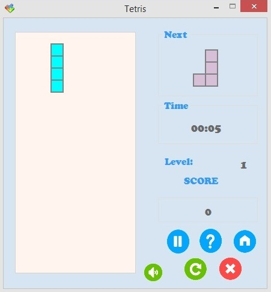

TetrisGame
===================

[Македонски](#macedonian) | [English] (#english) 


Implementation of the game Tetris in C#


<a name="english"></a>
####Table of Contents

 - [1.Description](#introduction)
 - [2.Functionalities](#functionalities)
 
   - [2.1.Playing Game](#playing)

   - [2.2.About Game](#about)
   
   - [2.3.End Game](#end-game)
   
   - [2.4.How to play](#game)
   
 - [3.Representation of the problem](#problem)
 
   - [3.1.Classes](#classes)
   
     - [3.1.1.Square](#square)
      
     - [3.1.2.Tetrimino](#tetrimino)
      
     - [3.1.3.Board](#board)

   - [3.2.Forms](#forms)
   
     - [3.2.1.Tetris](#tetris)
      
     - [3.2.2.HighScore](#highscore)
      
     - [3.2.3.DialogBox](#dialogbox)
     
   - [3.3.Controls](#controls)
   
     - [3.3.1.TetrisBox](#tetrisbox)


##1. <a name="introduction"></a>Description

**Tetris** is one of the most famous logical video games. The game was created in 1984 by Russian scientist Alexey Pajitnov. The name of the game "Tetris" comes from the Greek prefix **"tetra-" ("four")**, because all of the game's pieces contain four segments, and "**tennis**", Pajitnov's favorite sport. Most of its popularity, Tetris has received on Nintendo Game boy.

Segments (called tetrimino), composed of four squares, fall from the top of the game field, which is ten squares wide and twenty squares high. The player can rotate, move left and right and accelerate the decline of the falling tetrimino, or in other words to compose the tetriminos in a way that creates the most compact structure. When one line is filled with all the squares, it disappears, and squares that were above this line fall into the newly created space. As the game progresses, the tetriminos fall faster and the player has less and less time for thinking and composing. When any part of a falling tetrimino transcends the limit of the board in height, the game ends.

The next tetrimino that will appear at the top of the field is chosen at random. The tetriminos based on the order in which the squares are arranged in them resemble the letters I, J, L, O, S, T and Z. All parts can eliminate two rows, I, J i L can eliminate three rows, and only the I tetrimino can eliminate four lines at once - called "Tetris".

Points are assigned for each successfully eliminated row. Bonus points are awarded for eliminating multiple rows simultaneously (two, three, or "Tetris" - four).

##2. <a name="functionalities"></a>Functionalities

When the application is started, the initial view is shown. There are 3 choices. By clicking the **New Game** button game begins. A click on **About** buton opens the view with game description. The **Exit** button exits the application.


###2.1. <a name="playing"></a>Playing Game
After a click on the **New Game** button another view is shown. This view allows playing the game. The area for the game is in the left part of this view. Next tetrimino, number of points and elapsed time are shown in the right part of the view. This view has buttons that allow control of the game:
-  **Quit/Exit** -> quit the game and exit the application.
-  **New Game** -> begin a new game.
-   **Sound Off/On** -> turn the sounds of the game on or off.
-  **Main menu** -> go to the initial view of the application.
-  **Help** -> shows help about the rules of the game and how to play.
-   **Pause/Play** -> pause/play the game.



###2.2. <a name="about"></a>About Game
This view is shown after clicking the **About** button from the initial view or the **Help** button from the playing view. It contains the rules of the game and instructions for playing.


###2.3. <a name="end-game"></a>End Game
The game can be terminated in 4 ways:

- By clicking the **Exit** button. A window is shown in order to determine whether the user really wants to end the game. In case of a positive answer, the game is ended and application is terminated. Otherwise the game is continued.
When a falling tetrimino reaches the top of the game play area. In that moment a window with current score and highscore is shown. After closing this window a new game begins.

 

- When a falling tetrimino reaches the top of the game play area. In that moment a window with current score and highscore is shown. After closing this window a new game begins.
 
 

-  By clicking the **New Game** button from the playing view. A window with current score and highscore is shown and a new game is started.

- By clicking the **Main menu** button from the playing view. In order to determine whether the user really wants to end the game a window is shown. In case of a positive answer, the game is ended and the initial view of the application is shown. Otherwise the game continues.

 

###2.4. <a name="game"></a>How to play

This game can be played using arrow keys of the keyboard. The **left** button moves the tetrimino one position to the left. The **right** button moves the tetrimino one position to the right. The **down** button speeds up current tetrimino falling. The **up** button rotates the current tetrimino 90o clockwise. The goal of the game is to fill as many squares as possible on the board and earn as much points as possible.

##3. <a name="problem"></a>Representation of the problem

###3.1 <a name="classes"></a>Classes

####3.1.1. <a name="square"></a>Square

**Square** is a class that represents a single square. Every square is defined by its position, i.e. the coordinates X and Y, the length of its side, its colour and the colour of its border. The square has methods that enable it to move, left, right and down (this method is used to enable fast moving of the tetriminoes when the user is holding pressed the down arrow key), as well as a drawing method.

####3.1.2. <a name="tetrimino"></a>Tetrimino

The **Tetrimino** class is abstract. It represents the form tetrimino, i.e. the block that is falling down. There are 7 types of tetriminoes and every single one of them inherits from the Tetrimino class. Every tetrimino contains 4 squares. It should be able to move left and right, and to fall fast. It, also, needs to be able to rotate, during this process it crosses from one of 4 states, to another. The easiest way to implement and manipulate the Tetrimino is to have a class that represents a single square, in our implementation that is the class **Square**.

**Tetrimino** is a class that represents a single tetrimino, a block that falls down. Every tetrimino is defined by the positions of its squares and its colour. Every form has a distinct colour. In the class Tetrimino there is an array of objects from the class Square, which represents the 4 squares, since each one of them tracks it own position, it is unnecessary to keep track of the positions of the 4 squares in Tetrimino. However, in order to make writing methods and manipulating squares easier we do keep the coordinates of the first square. As well as this, we have a variable state, which tells us the state in which the tetrimino is, i.e. the rotation position is which it is at a given moment. Tetrimino contains the following methods:


- Draw(Graphics g, Point p) - uses the method Draw from the class Square to draw the squares that are contained in the tetrimino, effectively drawing the tetrimino itself.

```C#
    public void Draw(Graphics g, Point p)
        {
           for(int i=0; i<4; i++)
            {
                s[i].Draw(g, p);
            }
        }
```

- isOut() - checks if the newly formed tetrimino has appeared on the board yet, or is still in the space above the first line, where it is invisible to the user.

```C#   
     public bool isOut()
        {
            foreach(Square square in s)
            {
                if (square.Y < 0)
                    return true;
            }
            return false;
        }
```

- moveDown(List<Square[]> boardSquares) - uses the method moveDown() from Square to move every square one row down, by doing this effectively moving the entire tetrimino down. This method is used in order to enable fast falling of the tetrimioes when the user presses the down arrow. The moveLeft(List boardSquares) and moveRight(List boardSquares) methods are implemented accordingly.

```C#
    public void moveDown(List<Square[]> boardSquares)
        {
            if (safeDown(boardSquares) == true)
            {
                for (int i = 0; i < 4; i++)
                {
                    s[i].moveDown();
                }
            }
        }
        
        public void moveLeft(List<Square[]> boardSquares)
        {
            if (safeLeft(boardSquares) == true)
            {
                for (int i = 0; i < 4; i++)
                {
                    s[i].moveLeft();
                }
            }
        }

        public void moveRight(List<Square[]> boardSquares)
        {
            if (safeRight(boardSquares) == true)
            {
                for (int i = 0; i < 4; i++)
                {
                    s[i].moveRight();
                }
            }
        }
  ```       

- safeLeft(List<Square[]> boardSquares) - checks if every square of the given tetrimino is on the board, as well as whether the position of the tetrimino will be safe if it is moved one place to the left, i.e. whether the whole tetrimino will still be on the board. safeDown(List boardSquares) and safeRight(List boardSquares) are defined accordingly.
    
```C#
    public bool safeLeft(List<Square[]> boardSquares)
        {
            for (int i = 0; i < 4; i++)
            {
                if (s[i].X < 1 || s[i].X > 9)
                {
                    return false;
                }
                if (s[i].Y >= 0 && s[i].Y < boardSquares.Count() && boardSquares[s[i].Y][s[i].X - 1] != null)
                {
                    return false;
                }
            }
            return true;
        }

        public bool safeRight(List<Square[]> boardSquares)
        {
            for (int i = 0; i < 4; i++)
            {
                if (s[i].X >= boardSquares[0].Length - 1)
                {
                    return false;
                }
                if (s[i].Y >= 0 && s[i].Y < boardSquares.Count() && boardSquares[s[i].Y][s[i].X + 1] != null)
                {
                    return false;
                }

            }
            return true;
        }

        public bool safeDown(List<Square[]> boardSquares)
        {
            for (int i = 0; i < 4; i++)
            {
                if (s[i].Y >= boardSquares.Count - 1)
                {
                    return false;
                }
                if (s[i].Y >= 0 && s[i].Y < boardSquares.Count() && boardSquares[s[i].Y + 1][s[i].X] != null)
                {
                    return false;
                }
                if (s[i].Y == -1 && boardSquares[0][s[i].X] != null)
                {
                    return false;
                }
            }
            return true;
        }

```

- safe(List<Square[]> boardSquares) - chechks if the tetrimino is in the boundaries of the board, i.e. if the state in which we are at the moment is safe.*

```C#
    public bool safe(List<Square[]> boardSquares)
        {
            for (int i = 0; i < 4; i++)
            {
                if (s[i].X < 0 || s[i].X >= boardSquares[0].Length || s[i].Y >= boardSquares.Count())
                {
                    return false;
                }
                if (s[i].Y >=0 && boardSquares[s[i].Y][s[i].X] != null)
                {
                    return false;
                }
            }
            return true;
        }
```

- rotate() - an abstract method, implemented by all the tetriminoes, its goal is to find the positions of the squares in the case of rotation, i.e. it changes the coordinates of each square in order to attain a tetrimino which has been rotated 90 degrees clockwise, in respect to the previous state.

- tryRotate(List<Square[]> immovableSquares) - an abstract method, implemented by all the different tetriminoes, its goal is to check if a rotation is possible at the position where the tetrimino is located using the method safe(List boardSquares). If the rotation is possible, it is rotated, if not it is checked whether, considering the construction of the tetrimino and its current position, it is possible for it to be moved and then turned.

>*A tetrimino is in a safe state if the positions at which its squares are, are in the boundaries of the board, and none of them are already occupied by another tetrimino.

There are 7 concrete classes which inherit from the Tetrimino class: **TetriminoI**, **TetriminoJ**, **TetriminoL**, **TetriminoO**, **TetriminoS**, **TetriminoT** and **TetriminoZ**. Every one of them implements the methods rotate() and tryRotate(List immovableSquares). The rest of the methods are universal for all of them because of the fact that they are executed over the squares that they contain. These methods are contained within the class Tetrimino.


####3.1.3. <a name="board"></a>Board

**Board** is a class that represents the board of the game. It contains 20 rows and 10 columns made of squares, a list is used to store them. Graphically, it contains a grid of 20x10 squares where the tetriminoes fall. In the beginning the list is empty, and there are not any squares on the board, the board is empty. Once the tetrimino which is falling, cannot move anymore, it either reaches the bottom of the board, or it "hits" a square that is already taken, the squares that belonged to the tetrimino are added in the list of the board, in the respective positions. When a row of the board is full, every square is taken, it is "destroyed", and the number of the points the player has is increased, in this case the squares attain the value of null, and every square above this line which has had a valid value "falls", i.e. it moves one line down. This part of the logic is implemented in TetrisBox.

###3.2. <a name="forms"></a>Forms

####3.2.1. <a name="tetris"></a>Tetris

**Tetris** is the main visual form, it holds, in a way, the visual logic of the game. Here, there is an instance of TetrisBox, and here we control the detection of user activity, pressing or holding a key or choosing an option on the screen. From here we change the content of the screen when the game starts, or it is active, or a dialog window is opened.


####3.2.2. <a name="highscore"></a>HighScore

**HighScore** is an auxiliary form which shows the score of the player in the current game, and their high score until that moment. It appears every time the game ends, without regards for the way in which it ended.

####3.2.3. <a name="dialogbox"></a>DialogBox

**DialogBox** is an auxiliary form which enables a dialog box to be opened any time the user wants to turn off the game. The user can, then, choose whether they really want to stop the current game, or continue to play.

###3.3. <a name="controls"></a>Controls

####3.3.1. <a name="tetrisbox"></a>TetrisBox

**TetrisBox** is the basic component in which the logic of the game is implemented. In it we keep an instance of the class Board. As well as this, there is a timer which keeps track of the time that has passed since the beginning of the game, and it controls events such as the creation of a new tetrimino. TetrisBox also contains two instances of the class Tetrimino, currentTetrimino representing the tetrimino which is currently falling on the board, and nextTetrimino representing the next tetrimino. When the currentTetrimino has settled on the board, it is assigned the reference of nextTetrimino, and nextTetrimino becomes a new tetrimino which is chosen at random from the 7 different kinds. TetrisBox contains a variable score, which contains the number of points the user currently has, and also highScore, which has the value of the high score of this user. There are two variables **playing** and **paused**, which have the type bool, and they enable the game to be paused and continued from the same place where it was stopped, with the same data. We keep track of the level at which the player is, and the speed of the movement of the tetriminoes at the given moment. The method checkFullRows() checks if any of the rows of the board is full and if it is, it deletes it, it gives the squares of that row, which are contained in the instance of the class Board, the value of null.


<a name="macedonian"></a>

####Table of Contents

 - [1.Опис на апликацијата](#introductionM)
 - [2.Претставување на функционалностите](#functionalitiesM)
 
   - [2.1.Playing Game](#playingM)

   - [2.2.About Game](#aboutM)
   
   - [2.3.End Game](#end-gameM)
   
   - [2.4.Начин на игра](#gameM)
   
 - [3.Претставување на проблемот](#problemM)
 
   - [3.1.Класи](#classesM)
   
     - [3.1.1.Square](#squareM)
      
     - [3.1.2.Tetrimino](#tetriminoM)
      
     - [3.1.3.Board](#boardM)

   - [3.2.Форми](#formsM)
   
     - [3.2.1.Tetris](#tetrisM)
      
     - [3.2.2.HighScore](#highscoreM)
      
     - [3.2.3.DialogBox](#dialogboxM)
     
   - [3.3.Контроли](#controlsM)
   
     - [3.3.1.TetrisBox](#tetrisboxM)


##1. <a name="introductionM"></a>Опис на апликацијата

**Тетрис** е една од најпознатите логички видео-игри. Играта е направена во 1984 година од рускиот научник Алексей Пажитнов. Името на играта **"Tetris"** доаѓа од грчкиот префикс **"tetra-" ("четири")**, затоа што сите делови се составени од четири сегменти, и **"tenis"**, омилената игра на Пажитнов. Најголем дел од својата популарност Тетрис ја има добиено на [Nintendo Game boy](https://en.wikipedia.org/wiki/Game_Boy).

Деловите (наречени тетримино) составени од четири квадратчиња паѓаат од врвот на полето за игра, кое е широко десет, а високо дваесет квадратчиња. Играчот може тетриминото моментално што паѓа да го ротира, поместува лево и десно и да го забрзува неговото паѓање, односно да ги составува тетримината на начин што помеѓу квадратчињата да не останува празен простор. 
Кога еден ред се пополнува со сите делови, тој исчезнува, а квадратчињата кои биле над него паѓаат во новосоздадениот простор. 
Како што играта напредува, деловите паѓаат сè побрзо и играчот има сè помалку време за размислување и составување. Кога деловите се натрупуваат до врвот на полето за игра, без можност да се појави нов дел, играта е завршена.


На случаен начин се одбира кој тетримино следен ќе се појави на врвот на полето. Тетримината според редоследот на кој се наредени квадратчињата во нив, наликуваат на буквите **I, J, L, O, S, T и Z**. Сите делови можат да отстранат два реда, I, J i L можат да отстранат три реда, а само тетриминото I може да отстрани четири реда одеднаш - што се нарекува **"тетрис"**. 

Начинот на добивање поени е заснован на принцип така што поените се доделуваат со секој успешно елиминиран ред. Бонус поени се доделуваат за елиминирање на повеќе редови истовремено (два, три или "тетрис" - четири).

##2. <a name="functionalitiesM"></a>Претставување на функционалностите

На почетокот кога се стартува апликацијата се прикажува почетниот изглед. Тука има 3 можности за избор. Со кликнување на копчето **New Game** започува играта. Копчето **About** го отвара погледот кој содржи опис на играта. Со копчето **Exit** се исклучува апликацијата.


###2.1. <a name="playingM"></a>Playing Game
По кликнување на копчето **New Game** се отвара нов поглед кој овозможува играње на играта. Тука се одвива целата игра. Во левиот дел се наоѓа полето за игра. Во десниот дел се прикажуваат следното тетримино, времето кое изминало од почетокот на играта, нивото како и бројот на освоени поени. Во овој поглед има и копчиња кои овозможуваат контрола на играта:

-  **Quit/Exit** ⇒ исклучување на играта.

-  **New Game** ⇒ започнување нова игра.

-   **Sound Off/On** ⇒ вклучување/исклучување на звуците.

-  **Main menu** ⇒ префрлување на почетниот поглед.

-  **Help** ⇒ прикажување помош околу правилата и начинот на игра.

-   **Pause/Play** ⇒ паузирање/продолжување со играта.


###2.2. <a name="aboutM"></a>About Game
Овој поглед се отвара откако ќе се кликне копчето **About** од почетниот поглед или копчето **Help** од погледот за игра. Тука се опишани начинот и правилата на игра.


###2.3. <a name="end-gameM"></a>End Game
Играта може да заврши на 4 начини:

- Доколку се кликне копчето **Exit** при што се отвара прозорец за избирање дали навистина корисникот сака играта да биде завршена. Во случај на потврден одговор играта завршува и апликацијата се исклучува. Во спротивно се исклучува прозорецот и продолжува играта.

 

- Доколку со поставување на тетримината се стигне до врвот на полето за игра. Во тој момент се појавува прозорец во кој се прикажани освоените поени, како и највисоките поени кои се постигнати до тој момент. Откако ќе биде затворен овој прозорец започнува нова игра.
 
 

-  Доколку се кликне на копчето **New Game** од погледот за игра. При тоа се прикажува прозорецот во кој се прикажани освоените поени и највисоките поени кои се постигнати до тој момент. Потоа започнува нова игра.

- Доколку се кликне на копчето **Main Menu** од погледот за игра при што се прикажува прозорец за избирање дали навистина корисникот сака да оди во главното мени, односно на почетниот поглед. Во случај на потврден одговор играта завршува и се прикажува почетниот поглед. Во спротивно играта продолжува.

 

###2.4. <a name="gameM"></a>Начин на игра

Играта се игра со помош на копчињата за лево, десно, нагоре, надолу од тастатура. Со копчето за *лево* тетриминото се поместува за една позиција налево. Со копчето за *десно* тетриминото се поместува за една позиција надесно. Копчето за *надоле* го забрзува паѓањето на тетриминото. Копчето за *нагоре* го ротира копчето за 90<sup>o</sup> во насока на движењето на стрелките на часовникот. Целта е да се пополнат колку е можно повеќе квадратчиња од полето за игра и да се освојат колку е можно повеќе поени.


##3. <a name="problemM"></a>Претставување на проблемот

###3.1 <a name="classesM"></a>Класи

####3.1.1. <a name="squareM"></a>Square

**Square** е класа која претставува едно квадратче. Секое квадратче е дефинирано од неговата позиција, т.е. координатите Х и У, големината на неговата страна, неговата боја и бојата на неговата рамка. Квадратчето има методи кои овозможуваат тоа да се поместува, лево, десно и надолу (овој метод се користи за да се овозможи забрзано движење на тетримината надолу кога корисникот ќе притисне на стрелката надолу) како и метод за цртање.

####3.1.2. <a name="tetriminoM"></a>Tetrimino

Класата **Tetrimino** е апстрактна. Таа ја претставува формата тетримино, т.е. блокот кој паѓа. Постојат 7 видови на тетримина и сите тие ја наследуваат класата Tetrimino. Секое тетримино, по дефиниција содржи 4 квадратчиња, треба да може да се поместува лево и десно, да може да паѓа забрзано и да може да се врти, при тоа поминувајќи од една во друга состојба, такви има 4.
За да се најлесно имплементира и манипулира Tetrimino, потребно е да постои класа за квадратче, во нашата имплементација тоа е класата Square.

Tetrimino е класа која претставува едно тетримино, еден блок кој паѓа надолу. Секое тетримино е дефинирано од позицијата на неговите квадратчиња и неговата боја. Секоја форма има различна боја. Во Tetrimino се чува низа од Square, која што ги претставува 4-те квадратчиња, бидејќи секое квадратче си ја чува својата позиција, не е потребно да ги чуваме позициите на четирите квадратчиња во Tetrimino. Заради олеснување на пишување на функциите за манипулација на квадратчињата, тука сепак ги чуваме координатите на првото квадратче. Исто така, чуваме и променлива state, која ни кажува во каква состојба е тетриминото, т.е. во која ротација се наоѓа. Tetrimino ги содржи следните методи:

- Draw(Graphics g, Point p) - го користи методот Draw од класата Square за да ги исцрта квадратчињата кои ги содржи тетриминото и преку тоа самото тетримино.

```C#
	public void Draw(Graphics g, Point p)
        {
           for(int i=0; i<4; i++)
            {
                s[i].Draw(g, p);
            }
        }
```

- isOut() - проверува дали ново креираното тетримино се појавило на таблата или сèуште се наоѓа во просторот над првиот ред, каде што не е видливо за користникот.

```C#	
	 public bool isOut()
        {
            foreach(Square square in s)
            {
                if (square.Y < 0)
                    return true;
            }
            return false;
        }
```

- moveDown(List<Square[]> boardSquares) - го користи методот moveDown() на Square за да ги помести сите квадратчиња за еден ред подолу, со тоа поместувајќи го целото тетримино надолу. Овој метод се користи за да се овозможи забрзано движење на тетримината надолу кога корисникот ќе притисне на стрелката надолу.
Аналогно на ова се имплементирани и методите moveLeft(List<Square[]> boardSquares) и moveRight(List<Square[]> boardSquares).

```C#
	public void moveDown(List<Square[]> boardSquares)
        {
            if (safeDown(boardSquares) == true)
            {
                for (int i = 0; i < 4; i++)
                {
                    s[i].moveDown();
                }
            }
        }
        
        public void moveLeft(List<Square[]> boardSquares)
        {
            if (safeLeft(boardSquares) == true)
            {
                for (int i = 0; i < 4; i++)
                {
                    s[i].moveLeft();
                }
            }
        }

        public void moveRight(List<Square[]> boardSquares)
        {
            if (safeRight(boardSquares) == true)
            {
                for (int i = 0; i < 4; i++)
                {
                    s[i].moveRight();
                }
            }
        }
  ```      	

- safeLeft(List<Square[]> boardSquares) - проверува дали секое од квадратчињата од кои е составено тетриминото се наоѓаат на таблата и дополнително дали ако целото тетримино се помести на едно место за лево состојбата ќе биде безбедна, т.е. дали сèуште целото тетримино ќе биде на таблата. Аналогно на ова се дефинирани и safeDown(List<Square[]> boardSquares) и safeRight(List<Square[]> boardSquares).

```C#
	public bool safeLeft(List<Square[]> boardSquares)
        {
            for (int i = 0; i < 4; i++)
            {
                if (s[i].X < 1 || s[i].X > 9)
                {
                    return false;
                }
                if (s[i].Y >= 0 && s[i].Y < boardSquares.Count() && boardSquares[s[i].Y][s[i].X - 1] != null)
                {
                    return false;
                }
            }
            return true;
        }

        public bool safeRight(List<Square[]> boardSquares)
        {
            for (int i = 0; i < 4; i++)
            {
                if (s[i].X >= boardSquares[0].Length - 1)
                {
                    return false;
                }
                if (s[i].Y >= 0 && s[i].Y < boardSquares.Count() && boardSquares[s[i].Y][s[i].X + 1] != null)
                {
                    return false;
                }

            }
            return true;
        }

        public bool safeDown(List<Square[]> boardSquares)
        {
            for (int i = 0; i < 4; i++)
            {
                if (s[i].Y >= boardSquares.Count - 1)
                {
                    return false;
                }
                if (s[i].Y >= 0 && s[i].Y < boardSquares.Count() && boardSquares[s[i].Y + 1][s[i].X] != null)
                {
                    return false;
                }
                if (s[i].Y == -1 && boardSquares[0][s[i].X] != null)
                {
                    return false;
                }
            }
            return true;
        }

```

- safe(List<Square[]> boardSquares) - проверува дали тетриминото е во границите на таблата, т.е. дали состојбата во која сме моментално е безбедна*.

```C#
	public bool safe(List<Square[]> boardSquares)
        {
            for (int i = 0; i < 4; i++)
            {
                if (s[i].X < 0 || s[i].X >= boardSquares[0].Length || s[i].Y >= boardSquares.Count())
                {
                    return false;
                }
                if (s[i].Y >=0 && boardSquares[s[i].Y][s[i].X] != null)
                {
                    return false;
                }
            }
            return true;
        }
```

- rotate() - апстрактна метода, имплементирана во сите различни тетримина, има за задача да ја открие поставеноста на квадратчињата во тетриминото во случај на ротација. Ја дава наредната состојба, т.е. ги менува координатите на сите квадртачиња соодветно, со цел да добие тетримино кое е свртено за 90 степени во насока на стрелките на часовникот, во однос на претходната состојаба.

- tryRotate(List<Square[]> immovableSquares) - апстрактна метода, имплементирана од сите различни тетримина, има за цел да провери дали е можна ротација на позицијата каде што тетриминото се наоѓа користејќи ја методата safe(List<Square[]> boardSquares). Ако е можна, тогаш го врти, ако не проверува дали е можно, според конструкцијата и позицијата на самото тетримино, да се помести и тогаш да се сврти.

>*едно тетримино се наоѓа во безбедна состојба доколку позициите кои ги зафаќа се наоѓаат во границите на таблата и ниту една од нив не е веќе зафатена од некое претходно тетримино.

Постојат седум конкретни класи кои наследуваат од класата Tetrimino. Тоа се класите: **TetriminoI**, **TetriminoJ**, **TetriminoL**, **TetriminoO**, **TetriminoS**, **TetriminoT** и **TetriminoZ**. Секоја од нив ги имплементира методите rotate() и tryRotate(List<Square[]> immovableSquares). Останатите методи се универзални за сите нив поради тоа што се изведуваат над квадратчињата кои ги содржат. Овие методи се содржани во класата Tetrimino.

####3.1.3. <a name="boardM"></a>Board

**Вoard** е класа која што ја претставува таблата на играта. Содржи 20 реда и 10 колони од квадратчиња, кои се чуваат во листа. Графички содржи мрежа од 20х10 квадратчиња каде што паѓаат тетримината. На почетокот листата е празна, а на таблата нема ниту едно квадратче, таблата е празна. Еднаш кога тетриминото кое што моментално паѓа, нема да може повеќе да се движи, ќе стигне до дното на таблата или ќе 'удри' во веќе зафатени квадратчиња, квадратчињата кои му припаѓале на тетриминото се додаваат во листата на таблата, на соодветните позиции. Кога ќе се исполни еден ред од таблата тој се 'уништува', а бројот на поените на корисникот се зголемува, во овој случај квадратчињата од тој ред се поставуваат на null, а сите квадратчиња над овој ред кои биле пополнети 'паѓаат', т.е. се поместуваат за еден ред подолу. Овој дел од логиката е имплементиран во TetrisBox.

###3.2. <a name="formsM"></a>Форми

####3.2.1. <a name="tetrisM"></a>Tetris

**Tetris** е главната форма за приказ на целта игра, ја содржи, на некој начин, визуелната логика на играта. Овде постои инстанца на TetrisBox и овде се контролира забележувањето на корисничките активности, притискање на копче на тастатурата или избирање на некоја опција од екранот. Од овде се менува приказот на екранот кога играта почнува, или е активна или има дијалог прозорец кој е отворен.


####3.2.2. <a name="highscoreM"></a>HighScore

**HighScore** е помошна форма која ги прикажува score-от на играчот во дадената игра и нивниот hightscore до тој момент. Се појавува секогаш кога на било кој начин ќе заврши играта.

####3.2.3. <a name="dialogboxM"></a>DialogBox

**DialogBox** е помошна форма која овозможува отварање на dialog box секогаш кога корисникот сака да ја исклучи играта. Корисникот добива избор дали навистина сака да ја прекине тековната игра или сака да продолжи да игра.

###3.3. <a name="controlsM"></a>Контроли

####3.3.1. <a name="tetrisboxM"></a>TetrisBox

**TetrisBox** е основната компонента во која што се случува логиката на играта. 
Во неа се чува инстанцата од класата Board, која што ја претставува таблата со полињата каде што паѓаат тетримината. Исто така се чува и тајмер кој го мери времето кое поминало од почетокот на играта и ги контролира настаните, како создавање на ново тетримино. Се чуваат и две инстанци од класата Tetrimino, currentTetrimino го претставува тетриминото кое моментално се наоѓа/движи низ таблата, додека nextTetrimino го претставува наредното тетримино, по паѓањето на currentTetrimino тоа ја добива референцата на nextTetrimino, а nextTetrimino станува ново тетримино кое случајно се одбира од 7-те различни видови. Чуваме и променлива score, која го содржи бројот на моментални поени во играта и highScore која го претставува highScore-от. Се чуваат и две променливи playing и paused, од типот bool, кои овозможуваат играта да се паузира и да продолжи од истото место со истите податоци. Се чуваат и податоци за тоа до кое ниво сме стигнале и колкава ќе биде брзината на движење на тетримината. Методот checkFullRows() проверува дали некој од редовите на таблата е полн и ако е го 'брише', ги поставува референците на квадратчињата од тој ред, кои се чуваат во инстанцата од класата Board, на null.
